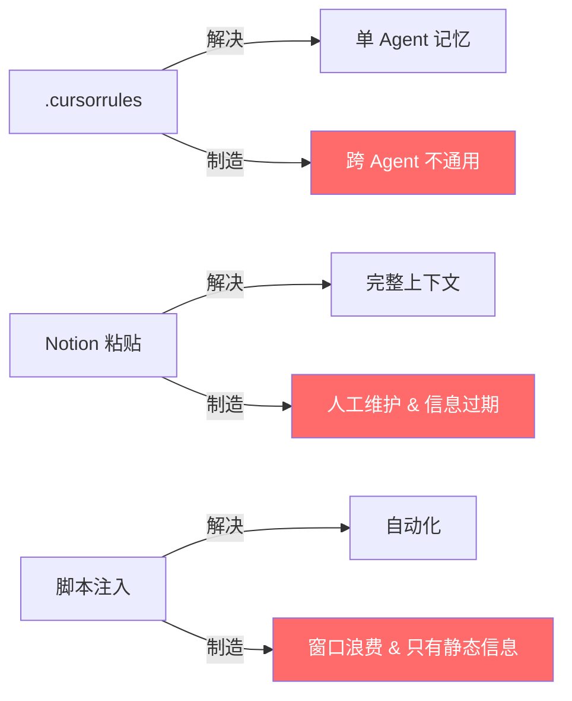
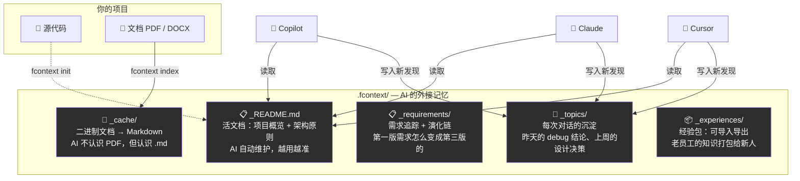
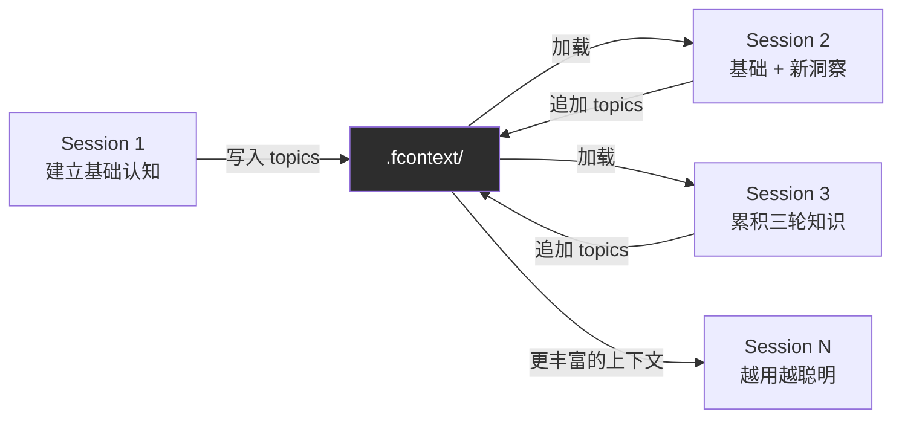

# 我的 AI 又双叒失忆了，所以我花两周做了个工具治它

太长不读：

凌晨两点跟 AI 聊出了完美方案，第二天它翻脸不认人。

我受不了了，花两周做了个开源工具 fcontext。

结果做完以后，**治好的不是 AI 的失忆，是我自己的工作方式。**

<!-- more -->

---

## 事情是这样的

上周四凌晨，我和 Cursor 一起重构一个核心模块。

从九点干到凌晨两点。改了七八版，边聊边骂，最后出来的东西我俩都服气。Cursor 甚至主动提醒我注意边界条件——说实话，某些人类同事都做不到这个。

我当时心想：这搭档真行啊。

第二天早上九点。新开会话。

> 我："昨天那个方案，异常分支怎么处理来着？"
>
> Cursor：**"您好，请问您指的是哪个项目？"**

我愣了五秒。

把键盘一推，去倒咖啡了。坐在工位上喝了半杯，盯着屏幕又愣了五秒。

然后我发了条朋友圈。

---

## 评论区炸了

老张第一个跳出来："哈哈我也是！每次新开窗口都要重新介绍业务背景，我都快背下来了。"

小李："更惨的是换 AI。上午用 Copilot 写前端，下午切 Claude 写后端，两边完全不通气，各说各话。"

王哥："新人入职那周最崩溃——教完人还要教他的 AI，同一套东西讲八遍。"

原来大家都一样啊。

我以为 AI 是智能助手。实际上它是个**金鱼脑**——聊完就忘，下次见面跟初次约会一样。

---

## 等等，这到底是什么类型的问题？

发完朋友圈我开始认真想这件事。

先算了一笔账。每天花在"重新给 AI 解释项目背景"上的时间，大约 40 分钟。一周 3.5 小时。一个月 14 小时。**一年 170 小时。**

170 小时什么概念？整整一个月的工作日，全拿来跟 AI 重新做自我介绍。够我多睡好几觉了 😐

但数字只是表象。逼着自己往深里想——**这事为什么一直没人解决？**

你看啊，如果这只是一个简单问题——比如"AI 不记得我用的是 Python 3.11"——那写个配置文件就搞定了。实际上有人确实这么做了，`.cursorrules` 里写几千字。问题解决了吗？换个 AI 就废了。

如果这是一个"专家能分析清楚"的问题——比如"上下文窗口不够用"——那等模型升级就行了。实际上呢？128K 窗口来了、1M 窗口来了，该忘的一样忘。**窗口再大也不是记忆。你的浏览器开了一百个标签页，不等于你记住了一百个网页的内容。**

麻烦就在这里。这事不简单，也不是靠堆资源能解决的。

它是一个**系统性问题**——开发者、多个 AI Agent、团队成员、项目文档，它们之间的交互方式本身就会产生上下文流失。不是某一环出了 bug，是整套协作模式的架构里就没有"记忆"这个层。

就好比你问"为什么城市交通拥堵"——不是因为某个红绿灯坏了，是因为城市规划里压根没给公共交通留足空间。

想通这一点，方向就清晰了：**不是优化某个 AI 的记忆，是在所有 AI 和人之间补上一个缺失的上下文层。**

---

## 顺藤摸瓜，看看别人怎么治的

方向有了，先别急着造轮子。我去看了一圈现有"药方"，想搞清楚一件事——**它们到底解决了什么，又制造了什么新问题。**

**方案一：`.cursorrules` 大法**

在配置文件里写几千字项目说明。

解决了什么？Cursor 确实能读到你的项目规矩了。

制造了什么？**厂商锁定。** Copilot 用 `.github/instructions/`，Claude 用 `.claude/rules/`，Cursor 用 `.cursor/rules/`。三家的格式互不兼容。你维护一份还不行，得维护三份。而且全是手动——项目一变，三份文件都得跟着改。

> 小李问我："那我维护个脚本自动同步三份呗？"
>
> 我："那你是在解决 AI 失忆的问题，还是在给自己制造运维问题？"

**方案二：Notion 粘贴流**

在 Notion 维护一份超详细的项目文档，每次跟 AI 聊之前手动粘贴进去。

解决了什么？上下文确实完整了。

制造了什么？**你变成了人肉 API。** 而且你注意——你粘进去的是静态文档，但项目是活的。昨天的决策推翻了，文档还是旧的。AI 拿着过期信息干活，出来的结果更危险。

**方案三：Prompt 注入脚本**

写脚本在每次对话前自动塞一段旧 prompt 进去。

解决了什么？自动化了粘贴环节。

制造了什么？**窗口污染。** 上下文窗口就那么大，你拿来塞旧信息，新内容还聊不聊了？而且脚本塞进去的全是静态的——它不知道今天 AI 在上一轮对话里又学到了什么。

三种方案，每一种都解决了一个真实的痛点。但也每一种都带出一个新的矛盾：

**根源在哪？都把"记忆"当成人的责任。**

你手动维护，你手动同步，你手动注入。本来用 AI 是为了省事，结果一半时间花在伺候 AI 上。

这就好比——你招了个天才实习生，能力贼强，但他每天早上走进办公室都完全不认识你。问他昨天的方案？"您好，请问您是哪位？"

然后你心想：行吧，那我每天早上重新自我介绍一遍呗。

**不对啊老铁。应该给他一份入职手册，让他自己回家看。**

不止。手册还得是活的——他每天下班前把新学到的东西追加进去。第二天来了，翻开手册，直接续上。换一个新实习生来？交接手册一递，齐活。

---

## 我需要什么，想清楚了

在动手之前，我把需求掰碎了想了想。

不只是"AI 能记住项目"这么简单。朋友圈里那几条留言其实暴露了**三个不同层次**的断裂——

**第一层：会话断裂。** 老张说的。昨天聊出来的决策，今天消失了。这是单人、单 AI、跨时间的问题。

**第二层：Agent 断裂。** 小李说的。上午 Copilot 做的事，下午 Claude 不知道。这是单人、多 AI、同时间的问题。

**第三层：团队断裂。** 王哥说的。你跟你的 AI 建立的默契，同事的 AI 完全不知道。新人入职更惨——不光要学业务，还要教他的 AI 学业务。这是多人、多 AI 的网状问题。

三层断裂，需要一个统一的解法。

所以这个工具需要满足几个核心原则——我不是拍脑袋想的，是被现有方案的失败**教**出来的：

**文件优先，不要 API。** 所有上下文用普通 Markdown 和 YAML 文件存储。为什么？因为每个 AI Agent 天然就会读文件。不需要额外的集成、不需要插件、不需要联网。这也意味着——数据全在你本地，不上传任何云服务。

**约定优先，不要配置。** 目录结构固定，比如 `_topics/` 就是放主题笔记的、`_requirements/` 就是放需求的。不需要你配一堆 YAML 告诉工具这个目录干什么。命名就是语义。

**Agent 无关，数据共享。** `.fcontext/` 目录是唯一真相源。各个 AI 读的是同一份数据。但每个 AI 需要的 instruction 格式不同——没关系，**生成**就好，不是拷贝。一行命令 `fcontext enable copilot`，自动生成 Copilot 认识的指令文件，指回 `.fcontext/`。换 Claude？`fcontext enable claude`，生成 Claude 认识的。数据不动，入口随便换。

**知识只增不删。** `_topics/` 里的内容只会越来越多，不会自动清理。为什么？因为你不知道三个月前的一次讨论会不会在今天的决策里有用。知识是积累的，不是消耗的。

---

## 行，开造

我给自己定了个规矩：**两周必须发布。做不出来说明方向有问题。**

开工后编了个打油诗激励自己：

> 周一搭骨架呀嘿 周二写命令呀嗬
>
> 周三适配三家AI 周四发现全不通
>
> 周五重写一大半 周末加班没人疼

先解决第一个问题：**AI 看不懂项目资料。**

产品经理丢过来一份 PDF 需求文档，70 页。设计师给了个 DOCX，里面有流程图。数据团队的 XLSX 字段说明……AI 压根读不了二进制文件。

**`fcontext index`** — 文档索引。PDF、DOCX、XLSX、PPTX……全部转成 Markdown 存进 `_cache/`。增量处理，源文件没变就不重新转。AI 不认识二进制？没关系，**我给你翻译成你认识的语言。**

这一步解决的不是"文件格式"问题，是"AI 能不能和你看同一份资料"的问题。你读完 PRD 理解了需求，AI 也读完了，你俩才有讨论的基础。

核心架构长这样：

各家 AI 的 instruction 机制**完全不同**——Copilot 要 `.github/instructions/`，Claude 要 `.claude/rules/`，Cursor 认 `.cursor/rules/`，Trae 用 `.trae/rules/`。说好的行业标准呢？没有的。

但反过来想——**正因为没有标准，才需要一个中间层来屏蔽差异。** `.fcontext/` 存数据，各家的 instruction 文件只是"指针"——告诉 AI "去那边读"。数据一份，入口多份。生成的 instruction 不是简单复制——每个 Agent 都有自己的规则格式，要生成**原生**的指令，不是通用文本的粘贴。

然后第二个问题来了：**AI 看完资料，聊完就忘。**

昨天跟 AI 讨论了一个架构决策，结论很重要——用 Kafka 而不是 RabbitMQ，原因是顺序消费 + 回溯能力。这个结论存哪？保存在聊天记录里？关了窗口就没了。

**`fcontext topic`** — 主题存档。每次对话结束前，AI 把关键结论写进 `_topics/`。下次来的 AI——不管是 Copilot、Claude 还是 Cursor——先扫一遍 topics，直接续上。这不是"记笔记"的问题——**这是让对话变成知识资产。**

topics 只增不删。为什么？因为你不知道三个月前的一次讨论会不会在今天的决策里有用。知识是积累的，不是消耗的。这些结论像年轮一样一层一层长出来——第一天是"选了 Kafka"，第三天追加了"按天分区"，第七天补充了"消费者 offset 手动提交"。到第十天，AI 对你这个模块的理解比你自己都清楚。

到这一步，AI 能读资料了，也能记住讨论了。但我发现还缺一块——**需求在变，谁来追踪？**

上上周加了个需求，这周需求变了。产品经理说"第一版不要了，改成这样"。你改了代码，但 AI 不知道——它还拿着旧需求在干活。更要命的是，两个月后有人问"这个功能为什么是这样的"，你自己也忘了当初怎么从 v1 演变成 v3 的。

传统做法是 Jira。但 AI 不会去翻你的 Jira。

**`fcontext req`** — 需求追踪，直接放在 `.fcontext/` 里。支持 story、task、epic、bug 四种类型，支持父子关系、状态流转、还有最关键的——**演化链**。需求变了不是删旧建新，而是 `fcontext req link STORY-002 supersedes STORY-001`。任何 AI 来了，`fcontext req trace` 一跑，完整的需求变化历史全出来了。

这里有个微妙的变化——当 AI 同时能读到需求定义、需求演化、架构决策和历史讨论的时候，它干的事情就不只是"写代码"了。它开始帮你**拆需求、找矛盾、追溯变更**。你说"做个用户鉴权模块"，它会先翻 req 看有没有相关的 story，再扫 topics 看之前有没有讨论过鉴权方案。

**fcontext + Agent，扮演了半个 BA 的角色。**

发布那天发了条 Tweet。没人回复。没人转发。没人点赞。

正常 🙂 Build in public 的日常。

---

## 画面太美，怕你走——下面讲真正震到我的事

> ⚠️ 以下内容涉及认知颠覆，对"我就是写代码的"这个自我定位有依赖的同学，建议到此为止。出门左转看公众号版本，比较温和。

做 fcontext 之前我以为：这就是个工具性质的工程问题。

做完以后用了一周，才发现——**这不是工具进步，是角色进化。**

一个对比你就懂了：

> **以前：**
>
> 我：写个函数，接收两个参数……
>
> AI：好的，给您写好了。
>
> 我：不对，这里要加个判断……
>
> AI：好的，已修改。
>
> 我：还是不对……

一说一写一审。全程盯着，一行一行指挥。这哪是用 AI，这是**当 AI 的键盘**。

> **现在：**
>
> AI（打开会话，自动读取 .fcontext/）：上次我们讨论了 Kafka + ClickHouse 的方案，按天分区。今天继续消费者逻辑？
>
> 我：对，先把 TASK-003 看一下，背景和约束都在 req 里。
>
> AI：收到。我读了 STORY-001 和相关的 topic 笔记，有个问题——你上次在 topic 里写了"offset 手动提交"，但 TASK-003 的约束里写的是"至少一次语义"，这两个可能冲突……

**它不光记住了。它还在质疑我。**

这才是真正让我震住的时刻。

用了 fcontext 之后，我的工作变成了三件事——

**定规矩。** 在 `_README.md` 里钉死架构原则。"禁止全局状态变量"、"所有外部调用走 adapter 层"、"命名用蛇形不用驼峰"。写在那儿，哪个 AI 来了都得守。不守？回去重读。

**派活。** 需求用 `fcontext req` 登记清楚，有父子关系，有验收标准，有演化历史。AI 自己去翻背景、找关联、出实现。我只管验收。

**存档。** 每次对话结束，AI 把关键结论写进 `_topics/`。这些结论像年轮一样积累。明天新开窗口，一句"继续昨天的进度"——它就活过来了。不是"恢复记忆"，是**比昨天更懂你一点**。

某天下午我盯着屏幕突然反应过来——

等等。

定规则。分任务。管进度。验收交付。处理需求变化。传承团队知识。

**这不就是 Tech Lead 干的事吗？**

不用自己写每一行代码。不用手把手指挥 AI 的每一步。只要确保——规矩清楚、需求清楚、知识不流失。

我本来只想治 AI 的失忆。

**结果发现：能不能记住你不重要，能不能持续学习你的项目才重要。**

AI 失忆是表象，缺乏上下文工程层是根因。fcontext 不是给 AI 吃了记忆药，而是在 AI 和你之间**架了一条持续运转的知识管道**。

**从写代码的人，变成管理写代码的 AI 的人。**

---

## 你以为故事就结束了吗

嘿，别走啊。

个人用的问题算是解了——三个断裂层（会话、Agent、时间），`.fcontext/` 一个目录全兜住。

但这只是第一关。后面还有 Boss：

**团队上下文共享。** 五个人，各自有各自的 AI。你的 AI 知道你重构了认证模块，他的 AI 不知道——然后他的 AI 在旧代码上继续写。怎么办？`.fcontext/` 提交到 Git，大家 pull 就完事了。但经验证明——粗暴共享会产生冲突。**所以我做了 Experience Pack。**

一个 Experience Pack 就是一份打包好的 `.fcontext/` 子集——`_README.md` + `_topics/` + `_cache/`。它是**只读的**。导入你的项目以后，你的 AI 可以读它（学习领域知识），但不能改它（避免污染源头）。

老员工离职了？把他的经验 export 成 pack。新人入职？`fcontext experience import`，他的 AI 十分钟内就知道这个项目的所有暗坑。

**VS 传统交接需要多久？两周。** 而且交接完新人的 AI 还是啥都不知道。

这些我都还在做。踩了不少坑，也有一些很有意思的发现——比如需求演化链 (`req trace`) 在实际项目里的表现比我预期好得多。

反正我是打算一直 build in public 下去了——过程全公开，踩坑全记录。

就算没人看也无所谓。

至少我自己的 AI 会记住 😏

---

代码在这，数据全在本地，不联网，不要 API Key：

👉 [github.com/lijma/agent-skill-fcontext](https://github.com/lijma/agent-skill-fcontext)

---

**关注我，一起把想法变成现实。**

`#BuildInPublic` `#AI编程` `#ContextEngineering` `#开发者工具` `#技术出海`
