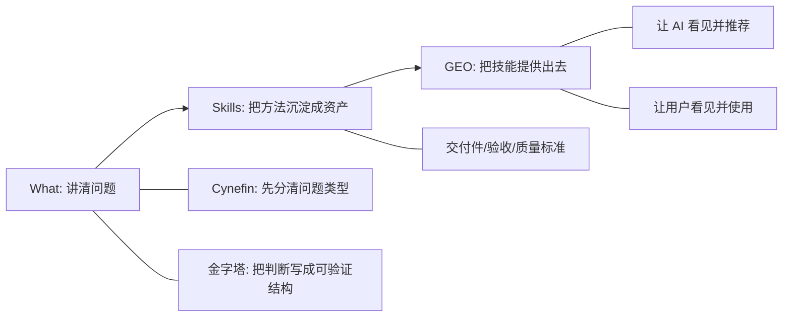
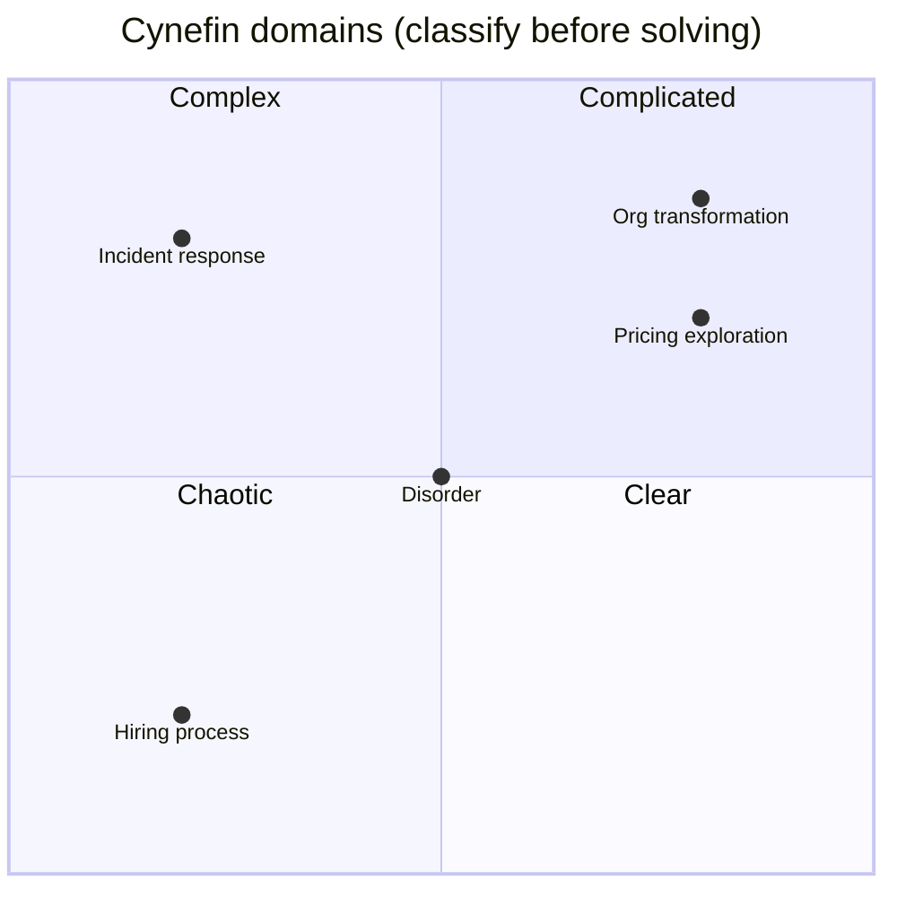
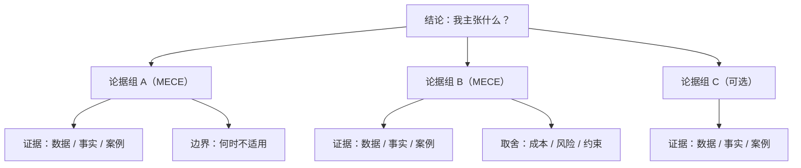

# 是什么
{: .fs-9 }

定义、行业、产品、关系、发展趋势和方向
{: .fs-6 .fw-300 }

---

理解一个领域，从搞清楚"是什么"开始。

这里不追求“百科全书式解释”。我更关心的是：

- 你面对的到底是哪一类问题？
- 这个问题的关键约束是什么？
- 你现在应该做的是“定义问题”，还是“优化方案”？

如果你经常卡在“信息很多，但不知道怎么下判断”，这个栏目就是为你准备的。

---

## 这个栏目解决什么 {#what-is-purpose}

你会在这里看到三类内容：

- 概念的**可用定义**：一句话说清它在解决什么，不解决什么
- 领域的**关键结构**：谁和谁在互动？价值从哪里来？风险从哪里来？
- 趋势的**可操作解读**：哪些变化值得你调整策略，哪些只是噪音

同时我会刻意加一个“思考钩子”：

> 如果 AI 变成默认能力，这个问题会被怎样重塑？

---

## 如何使用这里的框架 {#how-to-use}

在 MarvinTalk 的内容漏斗里，What 是“把问题讲清楚”的阶段。

我的默认流程是：

1. 用 Cynefin 先给问题分个类（别急着求解）
2. 用金字塔把论证结构写出来（让判断可被检验）
3. 再决定：要不要引入 AI、引入到哪一层、怎么验证

---

## 框架 1：Cynefin（先分清问题类型） {#cynefin}

Cynefin 最有用的一点是：它逼你承认不同问题需要不同解法。

- **简单（Clear）**：因果清晰，按最佳实践做
- **繁杂（Complicated）**：因果可分析，找专家/做设计
- **复杂（Complex）**：因果事后才明白，要用试验探索（probe-sense-respond）
- **混沌（Chaotic）**：先止血，再重建秩序

你会在这里看到我怎么用它来判断：

- 什么时候适合“标准化流程/清单”
- 什么时候必须“先做小实验再谈路线图”
- 什么时候“别上 AI（先把数据/流程/定义补齐）”

---

## 框架 2：麦肯锡金字塔（把判断写成可验证的结构） {#minto-pyramid}

金字塔不是写作技巧，它是“思考的防错装置”。

你会经常看到我按这个结构写结论：

- **结论先行**：我主张什么？（一句话）
- **分组支撑**：为什么？（2-4 组论据，MECE 优先）
- **证据落地**：每组论据用事实/数据/案例支撑

当你要做 AI/Agent/GEO 相关决策时，这个结构尤其重要：

- 它能把“看起来很合理”的幻觉，拆成“哪些环节可以验证”
- 它能让团队对齐：我们在争论的是结论，还是证据，还是边界

---

## 我会聊哪些话题（不限于） {#topics}

- AI：模型能力边界、RAG/Agent 的适用条件、评估与风险
- 编程技术：工程取舍、可维护性、性能与可靠性
- SDLC：从需求到上线的协作与交付机制
- 安全合规：数据、权限、审计、风险治理的现实约束
- 行业发现：行业结构、价值链、角色关系
- SEO / GEO：在 AI 时代如何“被看见”，以及为什么“被看见”不是玄学

贯穿这些话题的主线永远是同一个：

> 先把问题类型与约束写清楚，再谈解法与工具。

---

## 常见踩坑（你可能正在经历） {#pitfalls}

- **把复杂问题当繁杂问题**：试图一次性“设计出正确答案”，结果延期+返工
- **把工具当结论**：先决定“要用 AI/Agent”，再回头硬找场景
- **缺少验收标准**：讨论半天，最后落地时发现“成功是什么”没人说清
- **用概念替代证据**：听起来正确，但无法验证，也无法复盘

---

## 最佳实践清单（我写每篇 What 文章都会过一遍） {#checklist}

- 这是什么问题？用 Cynefin 归类（至少写出你为什么这么归类）
- 成功长什么样？写出 1-3 条验收标准
- 关键约束是什么？（时间/成本/合规/数据/组织）
- 主要备选方案有哪些？每个方案的 trade-off 是什么？
- 如果引入 AI：它替代的是哪一步？风险与评估怎么做？

---

## 一个实战小例子（示范写法） {#example}

问题：团队想做一个“内部知识问答”，到底是上 RAG，还是先把知识库流程做好？

- **Cynefin**：大概率是“复杂问题”——知识的质量、时效、口径一致性都是探索出来的
- **金字塔结论**：先把知识的来源/口径/更新机制做成流程与验收，再做小范围 RAG 试点
- **AI 思考钩子**：模型能回答问题，但不能替你决定“哪个版本的事实是公司口径”

你会在这个栏目里看到更多类似“先定义问题再选技术”的拆解。