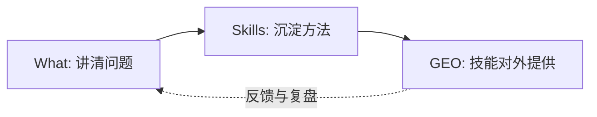

# MarvinTalk
{: .fs-9 }

**Help Makers and Founders build Skills and deliver value.**
{: .fs-6 .fw-300 }

[从这里开始](#start-here){: .btn .btn-primary .fs-5 .mb-4 .mb-md-0 .mr-2 }
[内容地图](#content-map){: .btn .fs-5 .mb-4 .mb-md-0 .mr-2 }
[GitHub](https://github.com/lijma){: .btn .fs-5 .mb-4 .mb-md-0 }

---

## Hi, 我是 Marvin（码文）
{: #about-marvin}

`AI` `Agent` `Skills` `GEO`

MarvinTalk 的主题很明确：

**用 AI 帮你更快`理解问题`，构建`可复用技能`，再让技能在 AI 时代`被看见并被选择`。**

这里不卖神话：没有万能 Prompt，没有一键致富的密码。

---

## 从这里开始
{: #start-here}

如果你只想快速判断“这站适不适合你”，看这三条路径：

1. **你在做什么、该做什么？** → 从 [是什么](what-is/) 开始
2. **想把能力练成可复用的“技能资产”？** → 先看 [Skills：技能资产](#skills)
3. **想在 AI 时代把技能“提供出去”？** → 先看 [GEO：让技能被看到](#geo)

---

## 内容地图
{: #content-map}

### 漏斗模型（What → Skills → GEO）

| 阶段 | 你会得到什么 | 站内入口 |
|:-----|:------------|:--------|
| **What（是什么）** | 把问题讲清楚：需求、场景、约束、验收标准 | [是什么](what-is/) |
| **Skills（技能）** | 把方法沉淀成资产，并讲清楚交付：交付件、质量标准、复盘 | [Skills：技能资产](#skills) |
| **GEO** | 把技能提供出去：让 AI 看见并推荐，让用户看见并使用 | [GEO：让技能被看到](#geo) |

### 标签怎么用（简单版）

每篇内容我都会尽量标清它属于哪个阶段：`#What` / `#Skills` / `#GEO`。

你看到 `#What`：别急着写代码，先把问题写对。

你看到 `#Skills`：这篇应该能复用，最好还能拿去交付。

你看到 `#GEO`：关注“技能如何被看见并被用起来”，不是 Demo。

---

## Skills：技能资产
{: #skills}

Skills 在这里不是“会什么技术栈”，而是**一套可复用的解决问题方式**。

我更关心这些问题：
- 这项能力能不能迁移到下一个项目？
- 能不能被写成 SOP / Checklist / 模板？
- 能不能用少量练习变得更稳定？

以及更现实的一句：
- **它能不能变成一份交付？交付件是什么？质量怎么验收？**

如果你也在做产品/服务/内容，建议你把目标从“做完一次”换成“把方法变成资产”。

---

## GEO：让技能被看到
{: #geo}

GEO 在这里不是“投机取巧的流量术”，而是**你向外提供 Skills 的方式**：

把技能做成产品或服务，让它：
- 能被 AI 理解与调用（被推荐、被集成、被复用）
- 能被用户发现与使用（被看见、被信任、被付费）

我会用同一套标准去看待任何 GEO/产品化尝试：
- 你的技能“对外”是什么形态？（文档/模板/服务/工具/Agent）
- AI 为什么要推荐你？（可读的描述、可验证的能力、可复用的接口）
- 用户为什么要用你？（明确收益、清晰边界、稳定体验）

当你把“提供方式”做清楚，你的技能才会从“我会”变成“别人用得到”。

---

### 生活碎片

| 栏目 | 内容 |
|:-----|:-----|
| [**随笔**](life/) | 旅行见闻、诗词创作、代码之外的胡思乱想 |

---

## 我的方法论
{: #methodology}

我写作的默认假设很简单：

> 大多数失败不是因为不努力，而是因为在错误的问题上努力。

所以 MarvinTalk 的主线是这条：

| 阶段 | 关键词 | 核心问题 |
|:-----|:-------|:---------|
| **#What** | 需求与约束 | 我到底在解决什么？如何验收？ |
| **#Skills** | 可复用能力 | 哪套方法能反复解决同类问题？ |
| **#GEO** | 提供与分发 | 如何把技能提供出去，让 AI/用户看见、使用并愿意选择你？ |

---

## 我做过的一些东西
{: #projects}

| 项目 | 简介 |
|:-----|:-----|
| [**A2UI Genie**](https://github.com/lijma/Genie) | AI 驱动的 UI 生成工具 |
| [**Jimmer ORM**](https://jimmer.org) | 参与推广的新一代 Java ORM 框架 |
| [**Cat Emoji Generator**](https://catemojigenerator.xyz/) | 一个周末用 AI 辅助完成的 VIBE Coding 实践 |

---

## 交个朋友
{: #contact}

如果你也在做产品、做工具、做服务，想把能力变成可交付的价值，我们大概率聊得来。

**Twitter**: [@marvinmlj](https://twitter.com/marvinmlj) · **公众号**: 码文技术出海 · **GitHub**: [lijma](https://github.com/lijma)
