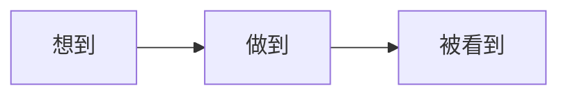

# MarvinTalk
{: .fs-9 }

**做到比想到重要，让别人看到更重要**
{: .fs-6 .fw-300 }

[开始阅读](#from-idea-to-product){: .btn .btn-primary .fs-5 .mb-4 .mb-md-0 .mr-2 }
[GitHub](https://github.com/lijma){: .btn .fs-5 .mb-4 .mb-md-0 }

---

## Hi, 我是 Marvin（码文）
{: #from-idea-to-product }

**全栈开发者 / 连续创业者 / 10年+ 演讲发烧友**

我是一名在这个行业摸爬滚打了 10+ 年的老兵。从 **Nokia** 到 **ThoughtWorks**，我做过技术咨询，写过核心代码。后来按捺不住“折腾”的心，跳出来创业，为海外保险巨头打造健康科技解决方案。

一路走来，我的角色不断切换：开发者、Tech Lead、售前顾问、讲师……甚至还在 **Toastmasters** 演讲社区“修炼”了整整 10 年。

这些经历让我深刻意识到：

> **光有好想法不够，做出来才算数；做出来还不够，让别人看到才有价值。**

这个博客，就是我践行这句话的**公开实验场**。

### 我做过的一些东西

- **[A2UI Genie](https://github.com/lijma/Genie)**  
  AI 驱动的 UI 生成工具，让设计到代码无缝衔接。
- **[Jimmer ORM](https://jimmer.org)**  
  参与推广的新一代 ORM 框架，致力于提升 Java 开发体验。
- **[Cat Emoji Generator](https://catemojigenerator.xyz/)**  
  一个周末用 AI 辅助完成的有趣小项目（MVP 实践）。

---

## 这里的“所谓”干货{: #build-launch-grow }
很多技术人（包括曾经的我）常有的困惑：
- **有想法**，但不知道是不是伪需求？
- **能实现**，但不知道从哪里开始构建？
- **做好了**，却发现根本没人用？

为了解决这些问题，**MarvinTalk** 专注于**从 0 到 1 再到 ∞** 的完整闭环：

### 1. #想到 (Thinking) — 拒绝伪需求

不要为了做而做。这里分享如何发现**真实痛点**、进行低成本的市场调研、以及如何用商业思维审视技术创意。

### 2. #做到 (Doing) — 极致执行力

把想法变成现实的硬核过程。包括 MVP 构建、技术选型（Java/AI/Flutter 等）、架构设计，以及那些踩过的坑和流过的泪。

### 3. #被看到 (Being Seen) — 放大影响力

酒香也怕巷子深。分享个人品牌建设、SEO 优化、内容营销以及社交媒体运营的实战经验。

---

## 最新文章
{: #latest-tutorials }

*(内容正在酿造中...)*

---

## 交个朋友
{: #join-community }

不管你是程序员、产品经理、设计师，还是任何不安于现状的**创造者**。只要你想把脑海中的火花变成手中的现实，我们就是同路人。

**GitHub**: [lijma](https://github.com/lijma)

关注我，见证**想法**如何落地生根。
