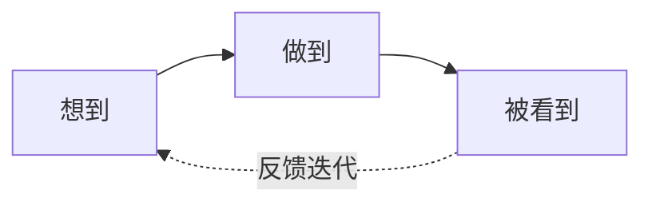

# 码文说
{: .fs-9 }

**做到比想到重要，让别人看到更重要**
{: .fs-6 .fw-300 }

[探索内容](#content-map){: .btn .btn-primary .fs-5 .mb-4 .mb-md-0 .mr-2 }
[GitHub](https://github.com/lijma){: .btn .fs-5 .mb-4 .mb-md-0 }

---

## Hi, 我是 Marvin（码文）
{: #about-marvin}

**全栈开发者 · 连续创业者 · 10年演讲发烧友**

从 **Nokia** 写代码起步，到 **ThoughtWorks** 做技术咨询和培训，再到跳出来创业为海外保险巨头打造健康科技方案——这 10+ 年我的角色一直在变：开发者、Tech Lead、售前顾问、讲师、教练。

"修炼"多年后，我越来越相信一件事：

> **光有好想法不够，做出来才算数；做出来还不够，让别人看到才有价值。**

这个博客，就是我把两者结合的**公开实验场**。

---

## 内容地图
{: #content-map}

### 认知框架

| 栏目 | 解决什么问题 |
|:-----|:-------------|
| [**是什么**](/what-is/) | 搞清概念、看懂行业、理解产品背后的逻辑 |
| [**如何做**](/how-to/) | 遇到具体问题，直接给解决方案 |

### 专题深耕

| 领域 | 内容方向 |
|:-----|:---------|
| [**AI**](/ai/) | 提示词工程、Agent 开发、AI 辅助编程实战 |
| [**Jimmer ORM**](/jimmer/) | 新一代 Java ORM，我深度参与推广的项目 |
| [**编程开发**](/programming/) | 架构设计、代码质量、技术选型的踩坑经验 |
| [**SDLC 企业数字化**](/sdlc/) | 敏捷、DevOps、从需求到上线的全流程 |
| [**高效沟通**](/communication/) | 英语、演讲、教练技术、咨询与培训 |
| [**GTM 增长**](/gtm/) | 市场调研 → 引流获客 → 销售转化 → 运营留存 |

### 生活碎片

| 栏目 | 内容 |
|:-----|:-----|
| [**随笔**](/life/) | 旅行见闻、诗词创作、代码之外的胡思乱想 |

---

## 我的方法论
{: #methodology}

很多技术人（包括曾经的我）常有的困惑：
- 有想法，但不知道是不是伪需求
- 能实现，但不知道从哪里开始
- 做好了，却发现根本没人用

**MarvinTalk** 专注于**从 0 到 1 再到 ∞** 的完整闭环：

| 阶段 | 关键词 | 核心问题 |
|:-----|:-------|:---------|
| **#想到** | 需求发现 | 这事儿值得做吗？谁会买单？ |
| **#做到** | MVP 交付 | 最小可行产品怎么快速验证？ |
| **#被看到** | 增长放大 | 如何让目标用户发现你？ |

---

## 我做过的一些东西
{: #projects}

| 项目 | 简介 |
|:-----|:-----|
| [**A2UI Genie**](https://github.com/lijma/Genie) | AI 驱动的 UI 生成工具 |
| [**Jimmer ORM**](https://jimmer.org) | 参与推广的新一代 Java ORM 框架 |
| [**Cat Emoji Generator**](https://catemojigenerator.xyz/) | 一个周末用 AI 辅助完成的 MVP 实践 |

---

## 交个朋友
{: #contact}

不管你是程序员、产品经理、设计师，还是任何不安于现状的**创造者**——只要你想把脑海中的火花变成手中的现实，我们就是同路人。

**Twitter**: [@marvinmlj](https://twitter.com/marvinmlj) · **公众号**: 码文技术出海 · **GitHub**: [lijma](https://github.com/lijma)
